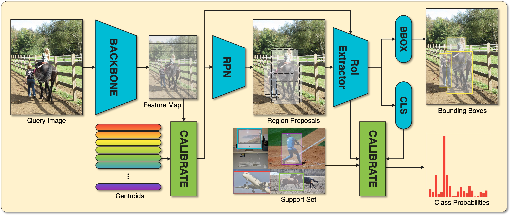

# Towards Few-shot Object Detection through Dual Calibration

The official PyTorch implementation for our work: [Towards Few-shot Object Detection through Dual Calibration](##)

### Abstract
> Few-shot object detection (FSOD) aims to enable object detectors to learn new categories from only a few instances. Due to the lack of training samples, object detectors tend to generalize poorly on novel classes. Unlike existing approaches that focus on calibrating either feature maps or prediction heads, our method introduces a new dual calibration strategy, operating at both the latent feature space and the prediction level within the object detector. More importantly, our dual calibration mechanisms possess distinct characteristics, setting them apart from existing calibration techniques. Concretely, we propose to improve the representation precisions by reducing the variances of the feature vectors using the highly adaptive centroids learned from ensembles of training features in the latent space, which are employed to calibrate the features and reveal the latent feature space's underlying structure. Moreover, we exploit the association between the query and support features to calibrate the inaccurate predictions, resulting from overfitting or underfitting the very few training samples and low training iterations. Through visualization, we demonstrate that our method produces more discriminative high-level features, ultimately improving the precision of an object detector's prediction. To validate the effectiveness of our approaches, we conduct comprehensive experiments on well-known benchmarks, including PASCAL VOC and MS-COCO, showing considerable performance gains compared to existing techniques.



## Updates
- (Aug 2023) Initial code released!

## Installation
**Requirements**
- Python 3.8
- [PyTorch](https://pytorch.org/) 1.10.0
- [detectron2](https://github.com/facebookresearch/detectron2/tree/v0.6) 0.6
- CUDA 11.1

## Data Preparation
The pretrained models used in this work can be downloaded from [PyTorch ResNet-101](https://download.pytorch.org/models/resnet101-cd907fc2.pth) [[link](https://download.pytorch.org/models/resnet101-cd907fc2.pth)]. The Detectron2 [script](https://raw.githubusercontent.com/facebookresearch/detectron2/main/tools/convert-torchvision-to-d2.py) is available for converting the PyTorch checkpoint into a Detectron2 backbone that is compatible. Please download the pretrained model to the directory `pretrain/`, and run the conversion script.

We evaluate our models on two datasets:
- [PASCAL VOC](http://host.robots.ox.ac.uk/pascal/VOC/)
- [MS\-COCO](https://cocodataset.org/#home)

We follow the data preparation procedures specified by [TFA](https://github.com/ucbdrive/few-shot-object-detection/blob/master/datasets/README.md).

The expected directory structure:
```
assets/
configs/
dataset/
    coco/
    cocosplit/
    VOC2007/
    VOC2012/
    vocsplit/
pretrain/
    R-101.pkl
src/
tools/
main.py
README.md
hashmap.sh
run_coco.sh
run_voc.sh
```

## Training and Evaluation
```bash
# PASCAL VOC experiments
sh run_voc.sh EXP_ID
# MS-COCO experiments
sh run_coco.sh EXP_ID
```

## Acknowledgement
This repository is developed based on [Detectron2](https://github.com/facebookresearch/detectron2).

